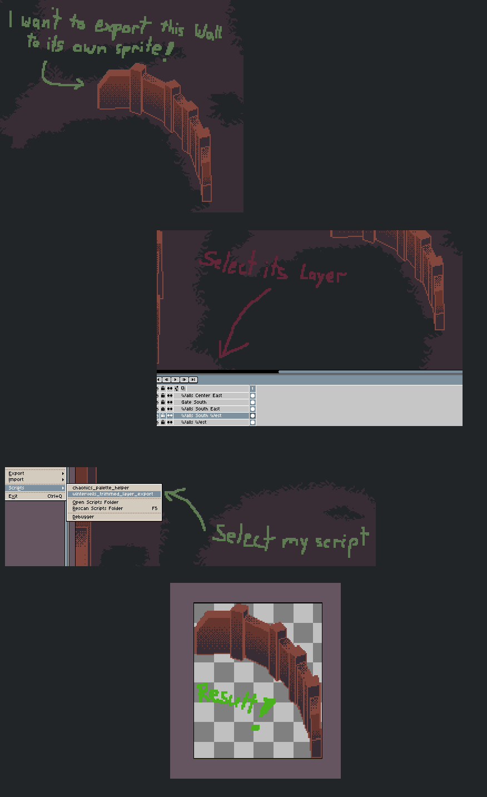

# Layer Exporter for Aseprite

This Lua script for Aseprite allows users to export a selected layer, trimming
its size to only its content. If the canvas is large but the layer contains a
small element in the middle, the script will produce an image trimmed around
that element.

## Usage

Here's a step-by-step guide describing what is shown in the example above:

1. **Select the Desired Layer**:  
   Navigate to the layers panel and select the layer containing the element
   that you wish to export.

2. **Run the Script**:  
   From the Aseprite menu, go to `File` -> `Scripts` and select the script.

3. **Get the Result**:  
   The script will process the selected layer and display a save dialog. Once
   saved, you'll get a trimmed image of the element, as shown below.

## Installation

1. Save the [script provided above](winterveils_trimmed_layer_export.lua) to a `.lua` file, for example,
   `winterveils_trimmed_layer_export.lua`.
2. Place the `.lua` file in your Aseprite scripts directory.
3. Restart Aseprite or refresh the scripts list.

## License
This script is available under the MIT license. For details see the
[LICENSE](LICENSE) file.
